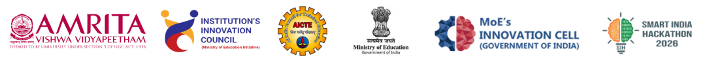

# Smart India Hackathon 2026 
#### Internal Hackathon @ Amrita Vishwa Vidyapeetham, Coimbatore Campus - Organized by Institution's Innovation Council (IIC)

  

## SIH26-A0H-T252
### Team Details
#### **LORD** <<Insert Your Team Name>>  
#### Team Members
|         Role    |         👤 Name         |   🎓 Roll Number      |     ⚧️ Gender   |    🏫 Department / Programme   |
|:---------------:|:------------------------|:----------------------:|:---------------:|:-------------------------------:| 
|   Team Leader   |    S.ASWATH                     |     CB.SC.U4CSE26607                   |    MALE             |       BETECH-CSE                          |  
|    Member 2     |  ISHI GUPTA                       | CB.SC.U4CYS26114                     |   FEMALE           |             BTECH-(CYS)                   |  
|    Member 3     |    AADISHA R B                     |     CB.SC.U4AIE26102                   |   FEMALE              |      BTECH-CS(AI)                          |  
|    Member 4     |     AISHWARYA ADARSH                    |  CB.SC.U4CYS26005                      |   FEMALE              |        BTECH-(CYS)                      |   
|    Member 5     |      SAHASRA GANDLA                   |    CB.SC.U4CYS26113                    |   FEMALE              |        BTECH-(CYS)                         |  
|    Member 6     |      HIRTHYA G                   |     CB.SC.U4CYS26019                   |     Female      |            BTECH-(CYS)                     |   

#### Mentor Details

|     Type       |       Mentor Name   |       Designation     |          Department     |       Official Email ID  |
|:--------------:|:--------------------|:---------------------:|:-----------------------:|:------------------------ |
| Academic       |  DR.Saurabh Shrivastava                   |    PROFESSOR                   |    CYBERSECURITY                     |      s_saurabh@cb.amrita.edu                    |
| Industry       |                     |                       |                         |                          |

-----

### Problem Statement(s)

#### PS#1

* **Problem Statement ID:26044
* **Problem Statement Title:Portal for Academia - Industry collaboration for Skill Mapping, Internships and Placement
* **Theme / Category:	Software
  /Smart Automation
* **Ministry / Organization:Ministry of Ayush/
  	All India Institute of Ayurveda

#### PS#2

* **Problem Statement ID:26144
* **Problem Statement Title:Design & Development of a High-Sensitivity Micro barometer Infrasound sensor
* **Theme / Category:Hardware
  /Smart Automation
* **Ministry / Organization:National Technical Research Organisation (NTRO)
  /National Technical Research Organisation (NTRO)
